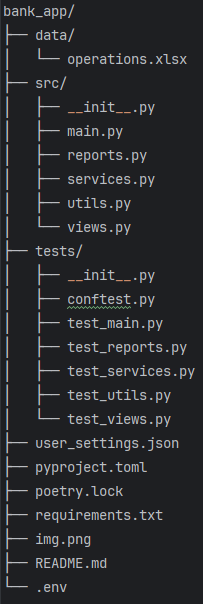

# Банковское приложение (Bank App)
## Описание проекта
Консольное приложение для анализа банковских транзакций из Excel-файла. Позволяет просматривать главную страницу с приветствием, информацией по картам, топ-транзакциями, курсами валют и ценами акций. Также реализована страница событий (расходы/доходы за период), простой поиск по категории/описанию и отчёт по тратам в заданной категории за последние 3 месяца. Все отчёты сохраняются в JSON-файлы.

## Установка и запуск
- Требования
- Python 3.13+

- Poetry (рекомендуется) или pip

## Установка зависимостей
С использованием Poetry:
```
poetry install
```

Или через pip:

````
pip install -r requirements.txt
````
## Настройка
Поместите файл с транзакциями в data/operations.xlsx (формат — как в примере из банка).

При необходимости создайте файл user_settings.json в корне проекта для указания отслеживаемых валют и акций:
````
json
{
    "user_currencies": ["USD", "EUR"],
    "user_stocks": ["AAPL", "AMZN", "GOOGL", "MSFT", "TSLA"]
}
````
Если файл отсутствует, используются значения по умолчанию.

## Использование
Запуск программы:

```
poetry run python -m src.main
```
или, если без Poetry:

````
python -m src.main
````
При запуске программа предложит выбрать режим работы:

1 — использовать текущую дату (сегодня)

2 — использовать последнюю дату операции из файла

После выбора будут последовательно выведены:

* Главная страница (приветствие, карты, топ-5 транзакций, курсы валют, цены акций)

* Страница событий за последний месяц (расходы, доходы, курсы, цены)

* Результат простого поиска по введённому слову

* Отчёт по категории «Супермаркеты» за последние 3 месяца

Все сгенерированные JSON-отчёты сохраняются в текущей директории с именем вида report_<function>_<timestamp>.json.

## Структура проекта
 
## Тестирование
Проект покрыт тестами с использованием pytest и unittest.mock. 

Для запуска тестирования с проверкой покрытия выполните команду:

```
poetry run pytest tests/ -v --cov=src
```

Для запуска тестирования без проверки покрытия выполните команду:

```
poetry run pytest tests/
```
Текущее покрытие кода (на момент написания) превышает 81%.

### Примеры тестов
* Мокирование внешних API (ЦБ РФ, yfinance)

* Параметризованные тесты для функций поиска

* Фикстуры с тестовыми DataFrame

* Проверка вывода функций печати через capsys

## Используемые технологии
* Python 3.13

* pandas — обработка Excel и транзакций

* requests — запросы к API Центробанка

* yfinance — получение цен акций

* python-dotenv — загрузка переменных окружения

* tabulate — форматированный вывод таблиц

* pytest, pytest-cov, pytest-mock — тестирование и покрытие

* mypy — статическая типизация 

## Документация

[Документация](https://github.com/BelSergey/bank_app/blob/master/README.md).